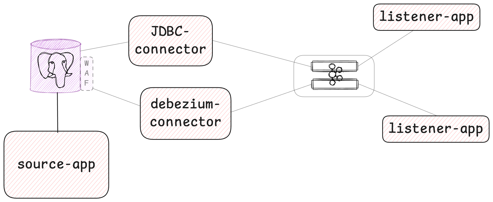

## outbox-pattern-demo

https://medium.com/@hguvenozgur/outbox-pattern-connectors-in-action-cac146ef30c7




#### Create JDBC connector 

```shell
# Create connector using configuration file
curl -X POST -H "Content-Type: application/json" --data @postgresql-jdbc-source.json http://localhost:8084/connectors
```


````shell
# Check active connectors
curl --location --request GET 'http://localhost:8084/connectors' \
--header 'Content-Type: application/json' 
````

```shell
curl -X GET http://localhost:8083/connector-plugins
```


#### Create Debezium connector 

````shell
# Create connector 
curl --location --request POST 'http://localhost:8083/connectors' \
--header 'Content-Type: application/json' \
--data-raw '{
    "name": "order-connector",
    "config": {
        "connector.class": "io.debezium.connector.postgresql.PostgresConnector",
        "tasks.max": "1",
        "database.hostname": "postgres",
        "database.port": "5432",
        "database.user": "admin",
        "database.password": "admin",
        "database.dbname": "orderdb",
        "database.server.name": "master-db"
    }
}'
````

````shell
# Get active connectors
curl --location --request GET 'http://localhost:8083/connectors' \
--header 'Content-Type: application/json' 
````
````shell
# Delete connectors
curl -i -X DELETE localhost:8083/connectors/inventory-connector/
````
