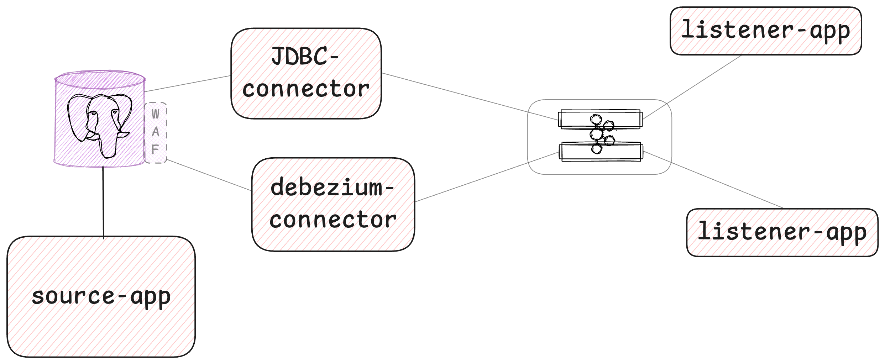

## outbox-pattern-demo




#### Create JDBC connector 

```shell
# Create connector using configuration file
curl -X POST -H "Content-Type: application/json" --data @postgresql-jdbc-source.json http://localhost:8084/connectors
```


````shell
# Check active connectors
curl --location --request GET 'http://localhost:8084/connectors' \
--header 'Content-Type: application/json' 
````